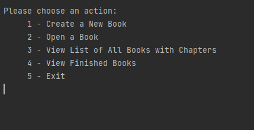
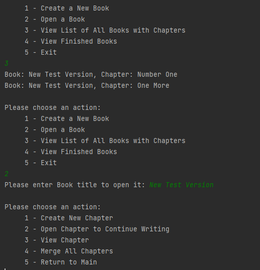

# Java Console Based Application 

Application provide to write books, long texts, etc., or continue previous started, saved/view the created books and chapters.
Information has bees stored using Files

Application has following functions:
```
- create the title of chapters when writing and when author finishes one chapter, new chapter can be started
- create the title of each book that is been written
- continue the previous chapter if needed
- ability to export all chapters as single book with title and chapters following each other as a single file or displayed to screen
- view chapters independently
```
Console output examples:




